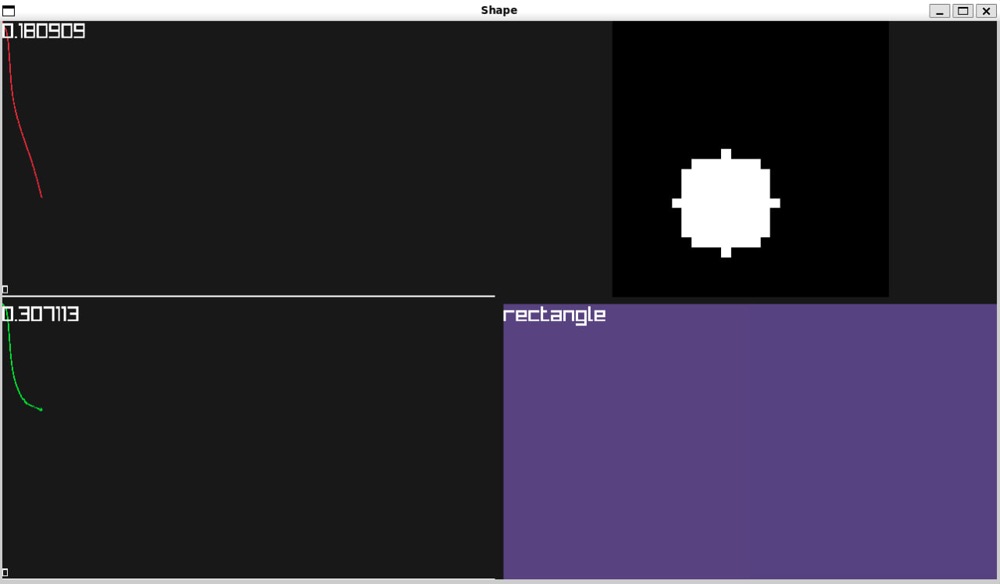
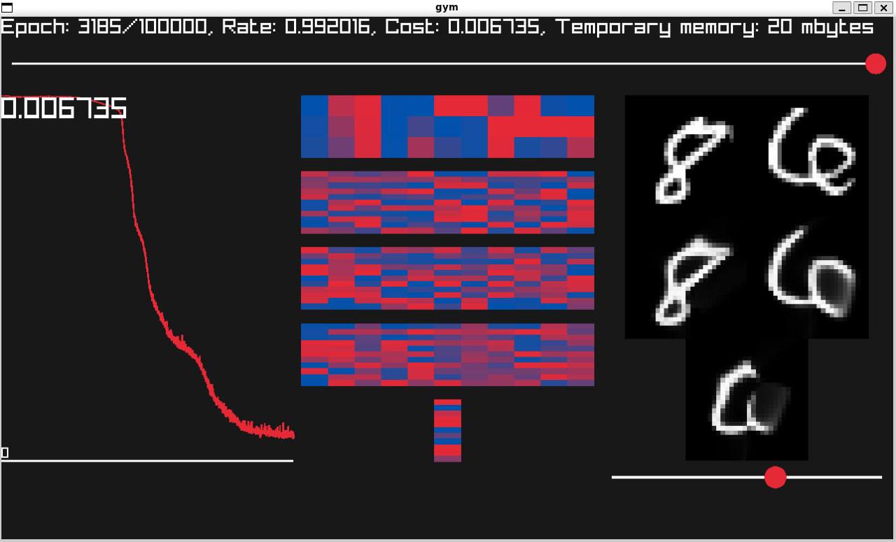

# synapse.h
Simple std-style library for training Neural Networks

# gym.h
Addition to synapse.h, gives you ability to render display your training results in GUI using raylib

## Prerequisites
You will need to install locally this packages:
1. raylib.h 
2. build-essentials

## Demos
In the demos folder you can find a few demos that uses synapse.h and gym.h

### shape.c
Trains NN that classifies shapes. It trained to distinguish rectangles and circles<br/>
In the right top corner there is drawable canvas, where you can make a shape and NN will try to figure out what shape it is<br/>
Also you can press "Q" or "W" to generate cirle or rectangle on this canvas<br/>
<br/>

<br/>
Example compile options:
```
#!/bin/sh
exec=shape

gcc -o build/$exec demos/$exec.c -O3 -Wall -lraylib -lGL -lm -lpthread -ldl -lrt -lX11

./build/$exec
```

### img2nn.c
Trains NN that tris to simulate two images<br/>
When you run compiled programm your give two images as input parameters and it trains NN to simulate first image if state parameter is 0 and second if parameter is 1.<br/>
So this gives you ability to look into what is between these two states. When you will change state parameter with given slider your will see smooth transition from one image to another.
<br/>
<br/>
After build you will see graphical window with:
1. Cost function plot
2. Representation of current state of neural network's weights as a heatmap
3. Current ability of neural network to upscale given image and below it slider to change state parameter from 0 to 1.
4. Slider at the top to change learning rate


<br/>
Example compile options:
```
#!/bin/sh
exec=img2nn

gcc -o build/$exec demos/$exec.c -O3 -Wall -lraylib -lGL -lm -lpthread -ldl -lrt -lX11

./build/$exec mnist/8.png mnist/6.png
```
