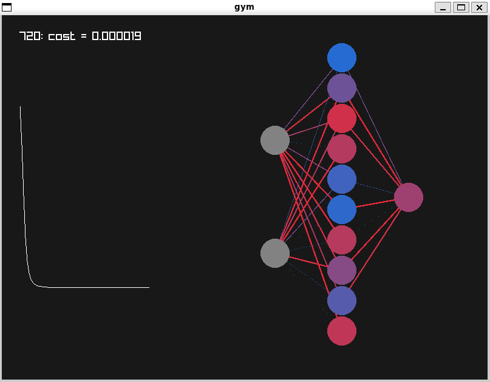
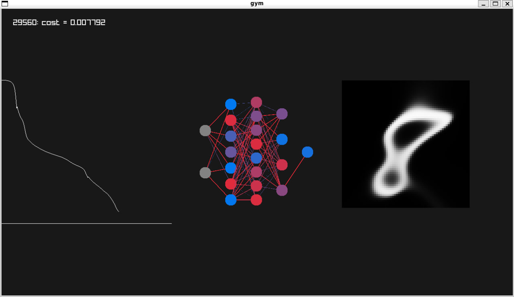

# synapse.h
Simple std-style library for training Neural Networks
## Installation
Start by:
docker-compose up -d
docer-compose exec synapse bash

To exit bash shell type "exit"
## gym.c
Example compile options:
```
#!/bin/sh
exec=gym

gcc -o $exec $exec.c -Wall -lraylib -lGL -lm -lpthread -ldl -lrt -lX11

./$exec xor.arch xor.mat
```
It requires arch file and file with training data.
</br>
As a result you will see graphical window with cost function plot and representation of neural network that updates its weights and biases on each frame.
</br>

## img2mat.c
Example compile options:
```
#!/bin/sh
exec=img2mat

gcc -o $exec $exec.c -O3 -Wall -lraylib -lGL -lm -lpthread -ldl -lrt -lX11

./$exec mnist/training/8/10057.png
```
It requires 8-bit and grayscale img file.
</br>
As a result you will see graphical window with:
1. Cost function plot
2. Representation of neural network that updates its weights and biases on each frame
3. Current ability of neural network to upscale given image (in our example we upscale 32x32 image to 64x64)
</br>

